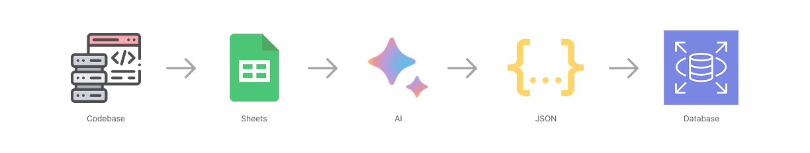
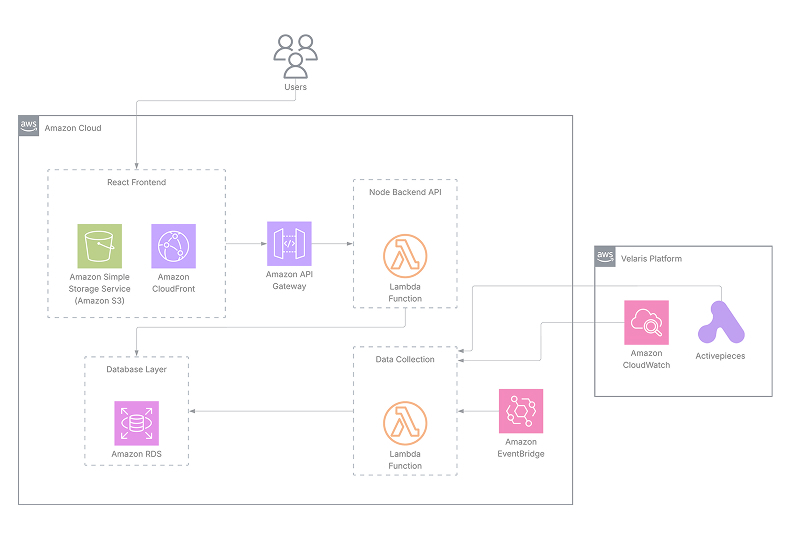

When I joined Velaris.io as a Software Engineering intern, I had five years of coding experience under my belt from basic HTML,CSS to React, Tailwind to complex APIs and programs with Node.js and Python. But on Day 1, I was introduced to something entirely different: a massive, AWS-heavy SaaS architecture serving hundreds of enterprise customers.

The challenge wasn't just learning new syntax—it was understanding systems at scale. And our team's first project would test exactly that.

My team was tasked with a critical internal tool: a Health Monitoring Dashboard. The goal was simple—help the internal staff identify integration failures. But the journey to build it taught me more about software engineering in three months than I had learned in years of tutorials.

Here is how we built a serverless dashboard that reduced incident diagnosis time by 90%, starting with zero cloud knowledge.

## The Problem: Finding the Needle in the CloudWatch Haystack

Velaris is a Customer Success Management (CSM) platform that integrates with dozens of third-party services—Salesforce, HubSpot, Zendesk, and more. Like any other SaaS company, it generates massive amounts of logs. To get an idea of the scale of the problem, out of all the log groups we had to deal with around 147 log groups yet alone with roughly 2.3 million log entries per day, with around 50 different signatures/events to track inside one log group.

When an integration failed or a tenant faced an issue, the engineering team had to perform a manual, what I came to call an "archaeological dig." They would log into the AWS Console, navigate to CloudWatch, sift through log groups, filter by timestamps, search for relevant keywords to find a root cause and start debugging.

It was slow, manual, and prone to fatigue. We realized that the internal team was spending on average 20 minutes just finding the problem before they could even start fixing it. This calculated to be approximately 18 hours per week on this manual process alone. That's half a full-time engineer's capacity just finding errors, not solving them.

The team didn't require an enterprise-grade observability platform with fancy dashboards and machine learning anomaly detection etc. They needed something simpler: a window into the chaos that would instantly flag "this integration is failing for this customer."

## Strategic Planning Over Immediate Coding: The "Humble" Foundation Phase

Coming from a freelance and personal project background, my instinct was immediate: open VS Code and start building. This project taught me why that approach doesn't work in production environments.

We didn't write a single line of code for the first three weeks.

Instead, we invested in the Software Development Life Cycle (SDLC) process that separates weekend projects from enterprise tools:

- **Requirement Gathering**: We revised and drafted our proposal three times before getting stakeholder approval. This iteration taught me that understanding the user's actual workflow matters more than technical elegance.
- **Cost Analysis**: Since we were building on AWS, every API call, Lambda invocation, and database query had a price tag. We had to ensure our solution wouldn't accidentally spike the cloud bill. The ROI was obvious, but documenting it was necessary for approval.
- **Scope Management**: We dealt with real-world scope creep, learning to negotiate features with senior stakeholders. Learning to say "yes, and we'll prioritize that for the next iteration" was as important as the technical work.

Looking back, this planning phase transformed the project from a "student summer project" to a "production tool that shipped to 20+ internal users."

## Taming the Data (The Technical Challenge)

The biggest technical challenge wasn't displaying data on a dashboard—it was normalizing unstructured log data into something queryable.

The company's micro-services architecture meant that each team logged differently. No centralized logging standard. No structured data. Just strings—thousands of variations of strings. We couldn't just query a database because the context we needed didn't exist in a structured format yet.

### The Investigation and The Pipeline

I had to step out of the IDE and step into the organization; into meeting rooms, online meetings, slack huddles and chats. Over a week, we held Knowledge Transfer (KT) meetings with different dev teams to reverse-engineer their logging patterns. The output: A master spreadsheet containing all tenants, integrations, events, schedulers and mapped log groups across 30+ pages 1200+ entities to track.

With this data I built a modern data pipeline involving AI: using LLMs to parse these chaotic patterns into structured JSON objects which then we seeded using a seed script into our database to create a reliable "map" for the dashboard. All the AI outputs of normalized patterns went through automated validation and manual review by me and my colleagues.

This eliminated the need for lines worth of complex RegEx parsers for each variation from our workload instead enabling us to map different keywords and query dynamically using the relational data.

## The Serverless Architecture: A Technical Deep-Dive

To ensure the dashboard was scalable, cost-effective, and didn't require infrastructure maintenance, We chose a fully serverless approach on AWS:

### Breakdown

**Frontend: React + Typescript + Tailwind + ReCharts**

- Single-page application for snappy, responsive UI
- Real-time updates via polling (considered WebSockets, deemed overkill)
- Deployed to S3 + CloudFront for global CDN distribution

**Backend (API Layer): Node.js with Fastify + AWS API Gateway**

- RESTful endpoints
- Pagination for efficient data transfer

**Backend (Data Collection Layer): AWS Lambda + AWS EventBridge + AWS RDS**

- Cost effective approach paying only for compute that is being used
- RDS with PostgreSQL to manage and store relational data

**Data: AWS CloudWatch + Activepieces**

## Challenges and Solutions: What Went Wrong (And How I Fixed It)

### Lambda Cold Starts

**Problem:** Lambda functions are idle until a request has been sent which causes the lambda to have a cold start every time the frontend requests data; common with serverless environments.

To address the unavoidable issue of cold starts in serverless environments, we implemented a robust optimization strategy. We selected Node.js with Fastify as our backend stack for its lightweight, low-overhead architecture and excellent official support via `@fastify/aws-lambda`, prioritizing it over heavier alternatives like Express or Python/FastAPI.

To minimize startup latency, we employed Container Reuse by initializing the application instance and database connections outside the handler scope, ensuring that only the first request incurs the initialization cost. Additionally, we optimized our build pipeline using tsup to minify the code and exclude the AWS SDK from the bundle. This significantly reduced the artifact size, speeding up the download and unpacking process during cold starts. While a small latency was acceptable for this internal monitoring tool, these measures ensured performance remained high.

### CloudWatch API Rate Limits

**Problem:** AWS CloudWatch have rate limits for number of concurrent queries, TPS limits per account/region for StartQuery and GetQueryResults.

To handle these rate limits, I implemented a custom Semaphore to cap concurrency at five parallel queries, ensuring we stay within AWS account limits. I also introduced request batching, where I group up to 15 entities into a single query using combined regex filters. This drastically reduces the total number of StartQuery API calls required. Then, a one-second polling interval was implemented for fetching results to avoid exhausting our GetQueryResults quota. Finally, I focused on delta syncing, querying only the short time window since the last update to keep executions fast, backed by the SDK's built-in exponential backoff.

### Complex Schema Design

**Problem:** Evolving a fragmented data model into a unified polymorphic schema while maintaining strict data integrity.

Initially, the project used disparate tables (events, internal_tasks, ap_flows) for different integration types, which made querying global health metrics inefficient and complex.

To solve this, I designed a unified `entities` table that serves as a polymorphic parent for all trackable items. I implemented complex SQL `CHECK` constraints directly in the database to enforce valid relationships based on the entity type. This design centralized our metrics collection logic, simplifying the dashboard queries significantly. I also utilized Drizzle ORM to manage these schema evolutions incrementally, ensuring safe migrations that moved data from legacy tables to the new structure without downtime or data loss.

## Impact: 90% Faster Resolution

The dashboard is now a reality.

What used to be a 15-20 minute process of navigating AWS menus has been reduced to a 2-minute check. Internal staff can now monitor tenant health on-demand and jump straight to the relevant error log, bypassing the AWS console clutter entirely.

## Key Takeaways for Aspiring Software Engineers

After three months of building, shipping, and maintaining this dashboard, here are the lessons that will stick with me:

### 1. Production Engineering is 20% Coding, 80% Everything Else

The actual React components and Lambda functions? Maybe 40 hours of work. The requirement gathering, cost analysis, testing, documentation, and stakeholder management? 120+ hours. Real software engineering is about solving organizational problems, not just technical ones.

### 2. Serverless is Not Always the Answer (But It Was Here)

I started this project thinking "serverless = modern = better." But serverless has tradeoffs: cold starts, vendor lock-in, debugging complexity. For this use case—unpredictable traffic, spiky usage, minimal state—serverless was perfect. For a different project, it might be the wrong choice. Understand the architecture, don't just follow trends.

### 3. AI is a Tool, Not a Magic Wand

Across various tasks I used different AI tools including Gemini, Claude and Perplexity which obviously boost and fast track my workflow but it didn't come without a catch. AI might give the right answer but it's not always the best answer. There was a lot of AI brainstorming and coding, and I came across lot of hallucinations, bugs and syntax errors but always I made sure to cross check with references and also across different models and also breakdown the task as much as possible leaving much less thinking for the AI. AI accelerates work; it doesn't replace thinking and it's a fact.

> Note: Models used: Gemini 3 Pro, Gemini 2.5 Pro, Claude Opus 4/4.5, Claude Haiku 4.5

### 4. User Feedback > Your Assumptions

I built a "fancy" graph view showing error trends over time. Users ignored it completely. What they actually wanted was a simple red/green status indicator and a "copy log group to clipboard" button. Ship fast, get feedback, iterate. Don't fall in love with features users don't need.

### 5. Document Everything, Especially When You Don't Want To

Future me at 2 AM debugging an outage was very grateful that past me wrote clear inline comments and maintained a troubleshooting wiki. Documentation feels like overhead until it's the only thing standing between you and chaos. With AI involved writing Documentation has never been so easy. Don't skip it.

## Final Thoughts: From Intimidated Intern to System Architect

I started this internship intimidated by AWS. I'd never touched CloudWatch, didn't know what Lambda was, and thought "serverless" was just marketing hype.

Three months later, I'd architected a production system that processes millions of log entries per week, serves dozens of internal users daily, and measurably saves the company time and money.

The biggest lesson? Technical skills are learnable—problem-solving mindset is what matters. I didn't build this because I knew AWS. I built this because I understood the pain point, broke it down into solvable pieces, and learned what I needed along the way.

For anyone reading this as a student or early-career engineer: You don't need to know everything before you start. You need curiosity, persistence, and the humility to ask questions. The rest is just documentation and Google searches and AI.

---

## Connect With Me

I'm currently in my second year pursuing a BSc in Computing major in Software Engineering and actively seeking full-time opportunities in cloud architecture, backend engineering, or Full-stack development.

Want to discuss this project, technology, or opportunities?

- **LinkedIn**: [hirusha-dinil-rubasinghe](https://www.linkedin.com/in/hirusha-dinil-rubasinghe-66bbba313/)
- **GitHub**: [github/lxnid](https://github.com/lxnid)
- **Portfolio**: [dinilr.com](https://dinilr.com)
- **Email**: [me@mail](mailto:offbeat-zombies.3q@icloud.com)

If you found this breakdown helpful, feel free to share it with aspiring engineers who might benefit from seeing the messy, real-world journey of building production software.
