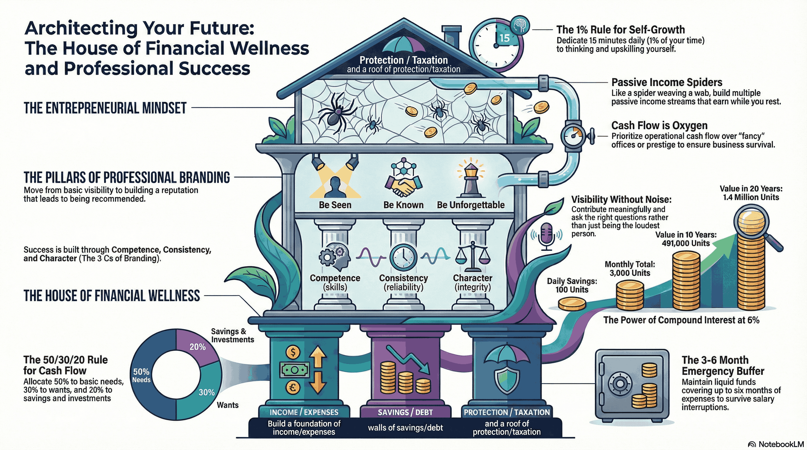

**January 18th, 2026** — I walked into the CIMA Auditorium not knowing what to expect. I walked out with a head full of ideas and a phone that hadn't been touched for hours.

That's the thing about Nexora 2025. The auditorium was freezing cold—cold enough that I had to step outside briefly just to warm up. But every time I left, I found myself rushing back. The conversations happening on that stage were too valuable to miss.

## What is Nexora?

Nexora 2025 was a two-day business and entrepreneurship talk series organized by the **AICPA & CIMA Students' Society** of Sri Lanka. The tagline? _"Empowering the Aura of the Next Era."_ And honestly, it lived up to that promise.

The event brought together some of Sri Lanka's most accomplished entrepreneurs, corporate leaders, and educators—people who've built empires, faced failures, pivoted through crises, and emerged stronger. The lineup included names like **Dulith Herath** (the man behind Kapruka.com), **Jehan Perinpanayagam** (CEO of Infomate and past SLASSCOM Chairman), **Stephanie Siriwardhana** (business psychologist and former Miss Sri Lanka), and many more.

## Why This Mattered to Me

I'm a Computer Science student with industry-level experience in software engineering. But here's what I've come to realize: **technical skills alone don't create lasting impact**. They don't move people. They don't spark movements or leave behind something meaningful when you're gone.

Sitting in that audience, I wasn't just a tech student—I was someone searching for what lies beyond the code. How do you create something that outlasts you? How do you build not just products, but legacies?

And these weren't theoretical lectures. These were war stories.

## The Sessions That Stayed With Me

### 1. Competition is Not the Enemy—Collaboration Is the Strategy

The final panel of the day tackled a question that every ambitious person eventually faces: _Is competition healthy, or is it just a zero-sum game?_

**Dhanushka Fernando**, an entrepreneur who's built multiple companies, shared how his team once acquired a competitor instead of fighting them head-on. "We didn't have the digital expertise," he admitted. "So we invested in a smaller firm, collaborated, and scaled together."

**Jehan Perinpanayagam** reinforced this with a phrase I wrote down immediately: _"Business is all about relationships."_ He talked about how SLASSCOM—an industry body where competitors technically sit at the same table—has united companies to solve problems like talent shortage and country branding that no single company could tackle alone.

The insight? Your biggest competitor today could be your strongest ally tomorrow. The pie isn't fixed—sometimes you grow it together.

### 2. "Trust and Confidence Drive Leadership"

This came from **Kasun Liyanage**, one of Sri Lanka's top A/L Economics and Business Studies lecturers. He's not just an academic—he spent over a decade in corporate roles at Unilever and CIC Holdings before transitioning to education.

What struck me was how he bridged the gap between textbook theory and real-world leadership. Trust isn't just a soft skill. It's the currency that makes teams move faster, take ownership, and stay loyal when things get hard.

### 3. The Vacuum Cleaner Story (and Why AI Isn't Your Enemy)

**Dhanushka Fernando** told a story that I couldn't forget. His company once hired a cleaner—a sensitive, hardworking guy who'd been referred by a friend. When they bought a vacuum cleaner to help him work faster, the man became terrified. He thought the machine was there to replace him.

The parallel to AI was obvious. "People fear AI like that cleaner feared the vacuum," Dhanushka said. But the vacuum didn't take his job—it made him more efficient.

For someone like me, deeply embedded in the tech world, this was a powerful reframe. AI isn't coming to replace developers. It's coming to amplify the ones who learn to use it.

### 4. Four Failed Startups Before Success

**Abdus Samad**, co-founder of Crepe Runner, shared his journey in the most honest founder case study I've witnessed. Before Crepe Runner became the beloved food brand it is today, there was:

- **Blue Man** — An apparel business with a 90-day cash conversion cycle that bled money
- **Laundry Runner** — A tech platform that died because they couldn't afford developers
- **Waffle Runner** — A food concept that didn't have the right product-market fit

Each failure taught them something. By the time they started Crepe Runner, they knew what _not_ to do.

"We stood on the street for 18 months, flagging down cars, explaining what a crepe even was," Abdus said. He was still working his day job, coming to the food truck at night to flip pancakes and chase customers.

Today, Crepe Runner has outlets in the Maldives and Indonesia. It's a reminder that persistence—not perfection—builds businesses.

### 5. "Nobody Grows in Comfort"

**Stephanie Siriwardhana**'s story was one of reinvention. From winning Miss Sri Lanka to being paralyzed in an accident and told she'd never walk again—to now running a foundation that works with prisons and survivors of abuse.

"You need to get uncomfortable," she said. "Nobody grows in comfort. You grow in discomfort."

She challenged all of us to think about how we want to be remembered when we're gone. Not in 50 years—maybe tomorrow. What would your epitaph say?

## What I'm Taking Forward

As a software engineer with entrepreneurial ambitions, here's what Nexora crystallized for me:

1. **Skills get you in the room. Relationships keep you there.** Technical ability matters, but so does trust, communication, and the ability to collaborate—even with competitors.

2. **AI is a tool, not a threat.** The developers who will thrive aren't the ones fighting AI—they're the ones using it to multiply their output.

3. **Failure is part of the process.** Abdus Samad didn't become successful despite his failures—he became successful _because_ of them. Each one narrowed the gap.

4. **Personal branding isn't vanity—it's visibility.** As Farhaz Farouk put it: _"What people say about you when you're not in the room—that's your personal brand."_ If you want to lead, you need to be seen, known, and unforgettable.

5. **Be a jack of all trades.** _"Jack of all trades, master of none, but better than a master of one."_ In a world that rewards specialists, the real advantage often goes to those who can connect dots across disciplines—code, business, design, communication.

## Final Thoughts

Nexora 2025 wasn't just an event. It was a concentrated dose of perspective from people who've actually built things—who've failed, pivoted, and won.

If you ever get the chance to attend something like this, take it. Put your phone down. Let the cold auditorium freeze you. The ideas you'll walk away with are worth it.

And to the AICPA & CIMA Students' Society team—thank you for putting this together. You've created something genuinely valuable.

_"What would your epitaph say?"_ — Stephanie Siriwardhana

That question is still echoing in my head. And honestly? I don't have an answer yet. But I'm working on one.
